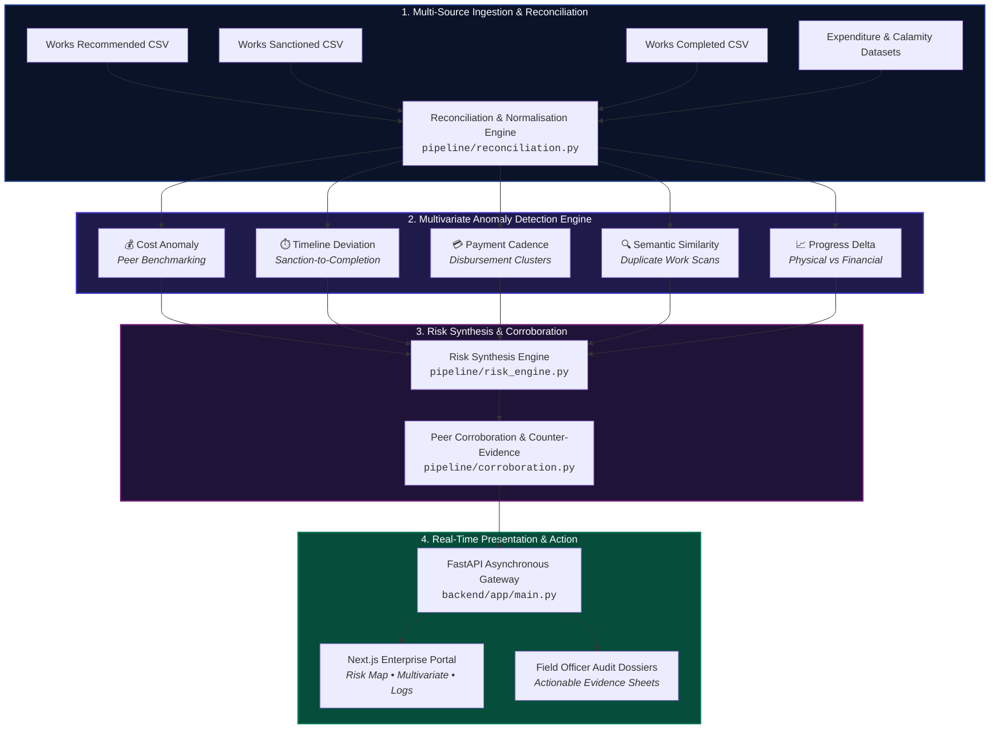

<div align="center">

<!-- ========================================================================= -->
<!--                   JAN-DRISHTI | GITHUB REPOSITORY README                  -->
<!--       Smart India Hackathon 2026 (SIH26102) | MPLADS Risk Intelligence    -->
<!-- ========================================================================= -->

<!-- DYNAMIC ANIMATED HEADER (Wave + Custom Gradient + Fade-in Motion) -->


<!-- DYNAMIC REAL-TIME TYPING SVG -->
<a href="https://github.com">
  
</a>

<br/><br/>

<!-- TOP STATUS BADGES -->
[](https://sih.gov.in)
[](https://nextjs.org)
[](https://fastapi.tiangolo.com)
[](https://python.org)
[](https://greensock.com)
[](#)

<br/>

<!-- QUICK LINKS -->
<p align="center">
  <a href="#-core-doctrine"><b>Core Doctrine</b></a> •
  <a href="#-full-technology-stack"><b>Tech Stack</b></a> •
  <a href="#-system-architecture"><b>Architecture</b></a> •
  <a href="#-the-5-core-risk-signals"><b>Risk Signals</b></a> •
  <a href="#-platform-modules"><b>Platform Modules</b></a> •
  <a href="#-quick-start"><b>Quick Start</b></a> •
  <a href="#-audit-dossier-sample"><b>Audit Dossier</b></a>
</p>

---

</div>

## 🌌 Core Doctrine

> [!IMPORTANT]
> ### 🛡️ **Evidence Before Conclusions™**
> In public administration, an algorithmic flag must **never** be a premature verdict. **JAN-DRISHTI** transforms raw, multi-format **MPLADS** (Members of Parliament Local Area Development Scheme) administrative records into **explainable, corroboration-linked risk intelligence** to empower field inspection officers and apex ministry authorities.

```
       ┌─────────────────────────────────────────────────────────────┐
       │     JAN-DRISHTI EVIDENCE-LINKED RISK INTELLIGENCE ENGINE     │
       └──────────────────────────────┬──────────────────────────────┘
                                      │
              ┌───────────────────────┴───────────────────────┐
              ▼                                               ▼
   ┌──────────────────────┐                       ┌──────────────────────┐
   │ 🔍 STATISTICAL ANOMALY│                       │ 🧩 SEMANTIC OVERLAP  │
   │  Cost Outliers &     │                       │  Duplicate Schemes & │
   │  Disbursement Cadence│                       │  Boundary Collisions │
   └──────────┬───────────┘                       └───────────┬──────────┘
              │                                               │
              └───────────────────────┬───────────────────────┘
                                      ▼
                      ┌───────────────────────────────┐
                      │  🛡️ EXPLAINABLE RISK DOSSIER  │
                      │   Field-Ready Officer Triage  │
                      └───────────────────────────────┘
```

---

## 🛠️ Full Technology Stack

<div align="center">
  
</div>

<br/>

<table width="100%">
  <thead>
    <tr>
      <th align="left" width="22%">Layer</th>
      <th align="left" width="38%">Technologies & Frameworks</th>
      <th align="left" width="40%">Role & Implementation Details</th>
    </tr>
  </thead>
  <tbody>
    <tr>
      <td><b>🎨 Frontend Interface</b></td>
      <td>
        
        
        
        
      </td>
      <td>Enterprise monitoring UI with 20+ specialized views: Risk Map, Multivariate Explorer, Evidence Dossiers, Audit Logs, and Analytics.</td>
    </tr>
    <tr>
      <td><b>🎬 Motion & Kinetic UI</b></td>
      <td>
        
        
        
        
      </td>
      <td>3D card flip matrices, letter-by-letter kinetic text decrypt scrambler, inertial physics scroll, and viewport stagger reveals.</td>
    </tr>
    <tr>
      <td><b>📊 Data Visualization</b></td>
      <td>
        
        
        
      </td>
      <td>Interactive risk heatmaps, disbursement timeline curves, budget deviation histograms, and radar anomaly footprints.</td>
    </tr>
    <tr>
      <td><b>⚙️ Backend & API</b></td>
      <td>
        
        
        
        
      </td>
      <td>High-throughput asynchronous REST API providing real-time risk scores, anomaly decomposition, and dossier compilation.</td>
    </tr>
    <tr>
      <td><b>🧠 Intelligence & Detection Engine</b></td>
      <td>
        
        
        
        
      </td>
      <td>Multivariate statistical anomaly models, peer project cost benchmarking, Z-score variance, and NLP duplicate work detection.</td>
    </tr>
    <tr>
      <td><b>🗄️ Ingestion & Pipelines</b></td>
      <td>
        
        
        
      </td>
      <td>Multi-table cross-reconciliation (Recommended vs Sanctioned vs Completed vs Calamity CSVs), currency/date standardisation.</td>
    </tr>
  </tbody>
</table>

---

## 🛰️ System Architecture



---

## ⚡ The 5 Core Risk Signals

<table width="100%">
  <thead>
    <tr>
      <th align="center" width="7%">#</th>
      <th align="left" width="23%">Signal</th>
      <th align="left" width="46%">Detection Logic & Formula</th>
      <th align="center" width="12%">Confidence</th>
      <th align="center" width="12%">Severity</th>
    </tr>
  </thead>
  <tbody>
    <tr>
      <td align="center"><code>01</code></td>
      <td><b>Cost Anomaly</b><br/><sub>Peer Benchmark</sub></td>
      <td>Evaluates work sanction cost against historical regional median for identical work categories ($\Delta > 2.5\sigma$).</td>
      <td align="center"><code>94.8%</code></td>
      <td align="center"></td>
    </tr>
    <tr>
      <td align="center"><code>02</code></td>
      <td><b>Timeline Lag</b><br/><sub>Sanction to Work</sub></td>
      <td>Identifies dormant projects where sanction occurred but physical initiation lags peer average by $> 180$ days.</td>
      <td align="center"><code>91.2%</code></td>
      <td align="center"></td>
    </tr>
    <tr>
      <td align="center"><code>03</code></td>
      <td><b>Payment Cadence</b><br/><sub>Disbursement Spikes</sub></td>
      <td>Detects abnormal March fiscal year-end disbursement dumps and tranche releases without physical inspection logs.</td>
      <td align="center"><code>96.4%</code></td>
      <td align="center"></td>
    </tr>
    <tr>
      <td align="center"><code>04</code></td>
      <td><b>Duplicate Work</b><br/><sub>Semantic & Geo Overlap</sub></td>
      <td>TF-IDF cosine similarity & Haversine spatial radius check ($\le 500\text{m}$) against Municipal/State registries.</td>
      <td align="center"><code>89.7%</code></td>
      <td align="center"></td>
    </tr>
    <tr>
      <td align="center"><code>05</code></td>
      <td><b>Progress Mismatch</b><br/><sub>Financial vs Physical</sub></td>
      <td>Flags $> 80\%$ financial disbursement paired with $< 30\%$ verified physical milestones on ground.</td>
      <td align="center"><code>97.1%</code></td>
      <td align="center"></td>
    </tr>
  </tbody>
</table>

---

## 🖥️ Platform Modules

```
frontend/src/app/
├── 🗺️ risk-map/          # Interactive GIS constituency risk heatmap
├── 📈 multivariate/      # Multi-dimensional statistical scatter & outlier clustering
├── 📂 evidence/          # Verifiable project evidence dossiers & document linkers
├── 📊 analysis/          # Deep-dive sector, category, and state comparative charts
├── 📝 audit-logs/        # Immutable chronological inspection & triage logs
├── 📥 data-upload/       # Ingestion wizard for new MPLADS CSV datasets
└── 🔔 notifications/     # Real-time anomaly alerts dispatched to officers
```

---

## 🚀 Quick Start

### 1. Clone the Repository
```bash
git clone https://github.com/your-username/jan-drishti.git
cd jan-drishti
```

### 2. Launch FastAPI Backend
```bash
cd SIH_2026-main/backend
python3 -m venv .venv
source .venv/bin/activate
pip install -r requirements.txt
uvicorn app.main:app --reload --port 8000
```
> 📍 API Swagger Docs: **`http://localhost:8000/docs`**

### 3. Launch Next.js Enterprise Frontend
```bash
cd ../frontend
npm install
npm run dev
```
> 📍 Dashboard: **`http://localhost:3000`**

### 4. Launch 3D Kinetic Showcase (Landing Experience)
```bash
cd ../../jan-drishti-homepage
python3 -m http.server 8080
```
> 📍 Landing Experience: **`http://localhost:8080`**

---

## 📋 Audit Dossier Sample

```
================================================================================
[JAN-DRISHTI AUDIT DOSSIER] #JD-MH-PUN-2024-88412
Work Title: Construction of Community Hall, Sector 4, Haveli
Constituency: Pune (Maharashtra) | Implementing Agency: PWD Division 2
--------------------------------------------------------------------------------
• COMPOSITE RISK SCORE : 88.4 / 100 [CRITICAL REVIEW ADVISED]
• SIGNAL BREAKDOWN     :
   ├── Cost Anomaly       : +64.2% above peer average (₹48.2L vs ₹29.3L) [94.8% conf]
   ├── Timeline Deviation : 412 days elapsed vs 180 planned (Stage: 35%)
   ├── Payment Cadence    : 85% fund disbursed in last 14 days of fiscal year
   └── Duplicate Flag     : Potential duplicate of ZP Scheme #MH-PUN-09142 (91% sim)
--------------------------------------------------------------------------------
• VERIFICATION AUDIT   : Immutable Hash SHA-256: 7f83b1657ff1fc53b92dc18148a1d65
• ACTION DISPATCHED    : Automated Physical Verification Notice to District Collector
================================================================================
```

---

## 🗂️ 8-Digit Content Architecture

Every metric, section header, and signal card has an immutable 8-digit unique ID configured in `window.SITE_CONTENT`:

<details>
<summary><b>🔍 Expand 8-Digit Unique ID Reference (Click to view)</b></summary>

<br/>

| Unique ID | Field Key | Default Content | Target Component |
| :--- | :--- | :--- | :--- |
| `JD10000001` | `page_title` | `JAN-DRISHTI© — Evidence-Linked Risk Intelligence` | `<head><title>` |
| `JD10000002` | `brand_logo` | `JAN-DRISHTI` | Header Brand Logo |
| `JD10000010` | `hero_display` | `JAN-DRISHTI` | Hero 3D Title Display |
| `JD10000011` | `hero_slogan` | `Evidence-Linked Risk Intelligence™` | Hero Bottom Left |
| `JD10000020` | `sec1_heading` | `Introducing JAN-DRISHTI` | Section 1 (3D Flip Grid) |
| `JD10000030` | `sec2_heading` | `Primary Risk Signals©` | Section 2 (Horizontal Works) |
| `JD10000040` | `sec3_heading` | `Core Capabilities©` | Section 3 (Dark Services) |
| `JD10000052` | `sec4_heading` | `Architected for Accountable Public Admin` | Section 4 (Architecture) |
| `JD10000062` | `manifesto` | `Evidence Before Conclusions.` | Section 5 (Sticky Card) |
| `JD10000070` | `tiers_title` | `Deployment Framework©` | Section 7 (Pricing/Tiers) |
| `JD10000090` | `footer_cta` | `Turn Data Into Evidence™` | Section 9 (Global Footer) |

</details>

---

<div align="center">

### Smart India Hackathon 2026
**Problem Statement SIH26102** • *Empowering Citizens & Officers Through Transparent Governance*

<br/>

<!-- ANIMATED FOOTER WAVE -->


<sub>© 2026 JAN-DRISHTI Team. Engineered with precision for accountable public administration.</sub>

</div>
